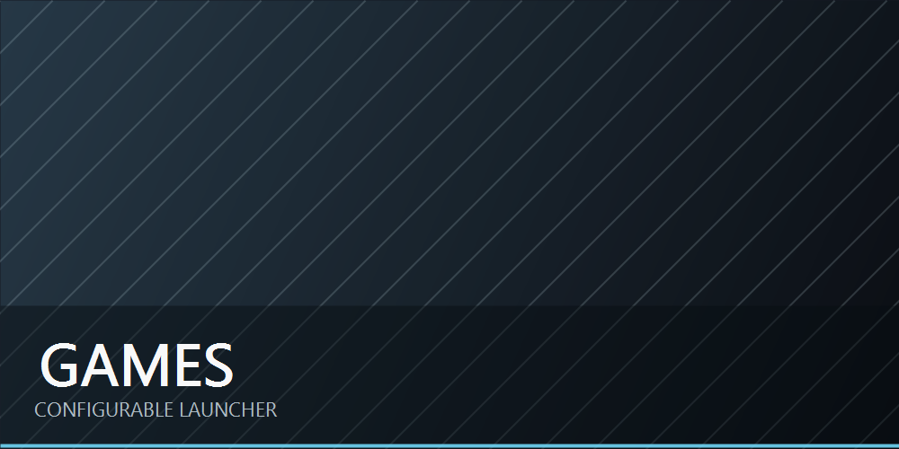

[English](README.md)

# SAO Utils Games Menu



Games Menu — минималистичный виджет-лаунчер игр и приложений для **SAO Utils 2** / **NERvGear** под Windows.

Версия **1.2.0** превращает виджет в локальную библиотеку: можно добавлять ярлыки, раскладывать карточки по категориям, менять их вид и при этом не трогать исходные файлы игр.

## Возможности

- Автоматически находит `.lnk` и `.url` в папке `shortcuts/` внутри пакета.
- Позволяет добавить один `.lnk`, `.url` или `.exe` перетаскиванием в Edit Mode.
- Назначает каждой карточке стабильный числовой ID по launch identity.
- Позволяет изменить отображаемое название, описание и изображение карточки без переименования ярлыка.
- Импортирует выбранные изображения во внутреннее локальное хранилище виджета. Поддерживаются PNG, JPG/JPEG и WebP, если их читает среда SAO Utils.
- В Edit Mode доступны безопасное редактирование, удаление, восстановление, сортировка и перенос карточек между категориями.
- Поддерживает пользовательские категории, их изображения и настройку масштаба иконок категорий.
- Сохраняет порядок, принадлежность к категориям и пользовательские изменения после перезапуска.
- Использует локальные управляющие иконки на основе Lucide. См. [уведомления о сторонних компонентах](THIRD_PARTY_NOTICES.md).

## Требования

- Windows с SAO Utils 2 и NERvGear API 1.x.
- Среда Qt 5 / Qt Quick 2.12, поставляемая с SAO Utils.
- Windows PowerShell и Windows Script Host.

## Установка

1. Скачай архив релиза и распакуй папку `saou.games.menu`.
2. Скопируй её в папку пакетов SAO Utils / NERvGear.
3. Перезапусти SAO Utils, если пакет ещё не появился в списке.
4. Открой **Games Menu**.
5. Один раз настрой действие закрытия:

   ```text
   ПКМ по Games Menu
   -> Close Action...
   -> Widget / Виджет
   -> Hide Widget / Скрыть виджет
   -> Games Menu
   -> OK
   ```

Видимостью виджета управляет SAO Utils. Для повторного открытия используй **Show Widget -> Games Menu** или **Toggle Widget -> Games Menu**.

## Добавление игр

### Через папку ярлыков

Помести `.lnk` или `.url` сюда:

```text
saou.games.menu/shortcuts/
```

Карточки появятся в системной категории **ALL** после первого сканирования или ручного Reload.

### Перетаскиванием

1. Включи **Edit Mode / Режим редактирования** кнопкой с карандашом в сайдбаре.
2. Перетащи на виджет один `.lnk`, `.url` или `.exe`.
3. Проверь данные в редакторе новой карточки и нажми **Add / Добавить**.

Исходный ярлык или `.exe` не переименовывается, не перемещается и не изменяется. Виджет хранит собственную ссылку запуска; при необходимости использует управляемую копию ярлыка, чтобы карточка не зависела от удаления исходника.

## Редактирование карточек и категорий

В Edit Mode запуск игр заблокирован, поэтому карточки можно менять без случайного запуска.

- Измени отображаемое название, описание и изображение карточки.
- Очисти пользовательское название или изображение, чтобы вернуться к автоматическому варианту.
- Меняй порядок карточек внутри категории кнопкой захвата.
- Перетащи карточку на другую категорию, чтобы перенести её. Если она уже есть там, виджет предложит копировать или переместить.
- Скрой карточку из лаунчера и верни её через **Settings / Настройки -> Restore / Восстановить**.
- Создавай, редактируй и удаляй пользовательские категории.
- Назначай изображение категории через путь или drop изображения.
- Меняй **Category Icon Scale / Масштаб иконок категорий** в настройках виджета.

Категория **ALL** системная: её нельзя удалить.

## Данные и файлы пользователя

Games Menu хранит пользовательское состояние локально и не записывает метаданные в файлы игр.

| Данные | Расположение | Примечание |
| --- | --- | --- |
| Стабильные ID и состояние карточек | `saou.games.menu/state/items.json` | Генерируемый локальный файл, игнорируется Git. |
| Ярлыки пользователя | `saou.games.menu/shortcuts/` | Стандартная папка сканирования, содержимое игнорируется Git. |
| Автоматические изображения старого формата | `saou.games.menu/user-assets/` | Необязательные изображения по имени ярлыка, игнорируются Git. |
| Изображения категорий | `saou.games.menu/folder-icons/` | Пользовательские файлы, игнорируются Git. |
| Импортированные изображения карточек | `%LOCALAPPDATA%\SAO Utils\Games Menu\custom-images` | Управляемые копии; исходное изображение не меняется. |
| Импортированные ярлыки | `%LOCALAPPDATA%\SAO Utils\Games Menu\managed-shortcuts` | Управляемые копии, если карточка должна пережить удаление исходника. |

Перед ручной заменой папки пакета сохрани `config.local.txt`, `shortcuts/`, `state/`, `user-assets/` и `folder-icons/`.

## Настройки

`saou.games.menu/config.txt` содержит настройки пакета. Для локальных изменений, которые не должны попасть в Git, создай:

```text
saou.games.menu/config.local.txt
```

Основные параметры:

```text
startHidden=false
maxColumns=3
syncSubtitle=true
folderIconScale=1
```

`shortcutsDir` остаётся расширенной настройкой для внешней папки с ярлыками. В обычной установке лучше использовать встроенную `shortcuts/`.

## Совместимость

- Старые категории, поиск ярлыков и автоматический поиск изображений продолжают работать.
- Если пользовательское изображение или исходный ярлык пропали, виджет не падает: карточка остаётся доступной для редактирования и использует безопасную заглушку.
- Старое локальное состояние карточек сохраняется и дополняется автоматически.

## Приватность и лицензии

Не добавляй в Git личные ярлыки, локальное состояние, изображения и конфигурации. Эти пути уже исключены через `.gitignore`.

Исходный код распространяется по MIT: [LICENSE](LICENSE). У изображений, названий игр и торговых марок действуют отдельные права; см. [ASSETS_NOTICE.md](ASSETS_NOTICE.md). Уведомления Lucide находятся в [THIRD_PARTY_NOTICES.md](THIRD_PARTY_NOTICES.md).

## История версий

См. [CHANGELOG.md](CHANGELOG.md).
